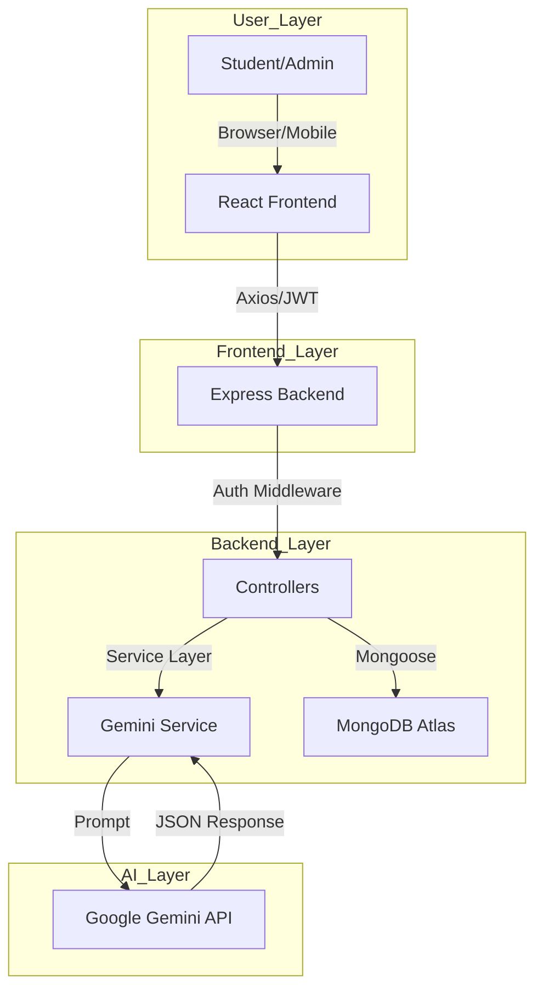
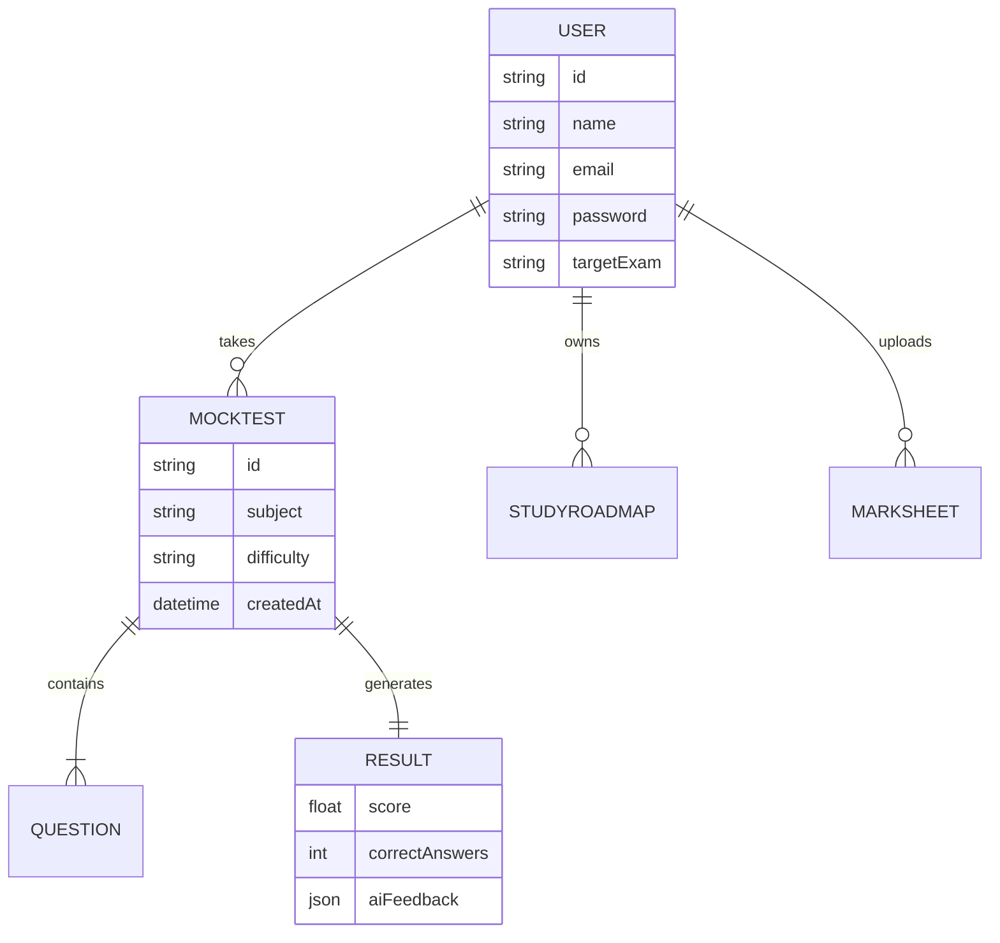

# Product Requirements Document (PRD): EduBridge AI

**Version:** 1.0  
**Status:** Draft / Investor-Ready  
**Date:** October 26, 2023  
**Role:** Technical Product Manager / Solutions Architect  

---

## 1. Executive Summary
**EduBridge AI** is a next-generation, AI-powered personalized learning platform designed to bridge the gap between generic educational content and individual student needs. By leveraging the **MERN stack** and **Google Gemini AI**, the platform transforms how students prepare for competitive exams. EduBridge AI provides a hyper-personalized experience through automated mock test generation, deep academic performance analysis, and dynamic study roadmaps that adapt to a student's unique learning pace and weaknesses.

---

## 2. Problem Statement
Current educational ecosystems suffer from several critical flaws:
*   **Generic Learning:** One-size-fits-all curriculum that ignores individual student speeds.
*   **Static Testing:** Traditional mock tests provide the same questions to every student, leading to rote memorization rather than conceptual clarity.
*   **Lack of Actionable Insights:** Students receive marks but rarely understand *why* they are failing or *how* to improve specific sub-topics.
*   **Planning Paralysis:** Students spend more time "planning" their study schedules than actually studying.
*   **Absence of Real-time Guidance:** Lack of 24/7 AI-driven mentorship to explain complex answers.

---

## 3. Proposed Solution
EduBridge AI solves these challenges by acting as a 24/7 AI Tutor:
*   **Adaptive Testing:** Uses Google Gemini to generate unique, difficulty-adjusted questions every time.
*   **Automated Analysis:** Analyzes uploaded marksheets to identify historical patterns.
*   **Dynamic Roadmaps:** Generates comprehensive study plans including health, sleep, and revision cycles.
*   **Data-Driven Growth:** Provides a visual analytics dashboard to track progress over time.

---

## 4. Objectives
### Short-Term Goals
*   Launch a functional MVP with AI Test Generation and Study Roadmaps.
*   Achieve a sub-3-second response time for AI-generated content.
*   Onboard 1,000+ beta users for feedback.

### Long-Term Goals
*   Integrate OCR for physical marksheet scanning.
*   Implement a Teacher/Parent dashboard for institutional use.
*   Expand into a mobile-native application with offline AI capabilities.

---

## 5. Target Audience
*   **School Students (K-12):** Focusing on board exams and foundational concepts.
*   **College Students:** Semester preparation and technical skill building.
*   **Competitive Exam Aspirants:** (JEE, NEET, UPSC, GRE, etc.) requiring high-intensity practice.
*   **Educational Institutions:** Seeking to provide personalized tools to their student body.

---

## 6. User Personas

| Persona | Age | Goals | Pain Points | Needs |
| :--- | :--- | :--- | :--- | :--- |
| **Aarav (Aspirant)** | 18 | Crack JEE Mains | Overwhelmed by syllabus; can't identify weak areas. | Adaptive tests focusing on Physics/Math. |
| **Priya (College)** | 21 | Maintain 9.0 GPA | Struggles with time management between projects. | A roadmap that balances study and rest. |
| **Rahul (Repeater)** | 23 | Clear Civil Services | Needs fresh questions; tired of repeating old mocks. | AI-generated unique questions every attempt. |

---

## 7. Product Features & Functional Requirements

### 7.1 Authentication
*   **Requirement:** Secure user onboarding and session management.
*   **Features:** Email/Password registration, JWT-based login, Password hashing (bcrypt).

### 7.2 AI Test Generator
*   **Input:** Subject, Topic, Difficulty Level, Number of Questions.
*   **Workflow:** Backend sends prompt to Gemini API → Gemini returns JSON questions → Frontend renders interactive quiz.
*   **Output:** Real-time timer, instant result calculation, AI-generated explanations for wrong answers.

### 7.3 AI Marksheet Analyzer
*   **Input:** Manual entry of marks (Future: OCR Upload).
*   **Workflow:** AI processes historical data to find trends.
*   **Output:** Strength/Weakness chart, "Focus Areas" recommendation list.

### 7.4 AI Study Roadmap
*   **Input:** Target Exam, Current Date, Target Score.
*   **Output:** 7-day/30-day schedule including:
    *   Study blocks and Revision cycles.
    *   Health/Sleep recommendations.
    *   Daily motivational quotes.

### 7.5 Analytics Dashboard
*   **Features:** Progress line charts (Chart.js/Recharts), Subject-wise heatmaps, Test history logs.

---

## 8. Non-Functional Requirements
*   **Performance:** AI responses must be streamed or handled with loading states to ensure UX fluidity.
*   **Scalability:** Architecture must support horizontal scaling via Docker/Kubernetes (Future).
*   **Security:** All API routes must be protected by JWT; sensitive data encrypted at rest in MongoDB.
*   **Availability:** 99.9% uptime target using Vercel and Render's managed environments.
*   **Usability:** Mobile-responsive UI built with Tailwind CSS.

---

## 9. System Architecture Overview

### 9.1 Architecture Diagram

---

## 10. Tech Stack
*   **Frontend:** React.js, Vite, Tailwind CSS, React Router, Axios.
*   **Backend:** Node.js, Express.js.
*   **Database:** MongoDB Atlas (NoSQL).
*   **AI:** Google Gemini Pro API.
*   **Authentication:** JSON Web Tokens (JWT).
*   **Deployment:** Vercel (Frontend), Render (Backend).

---

## 11. Database Design (ER Diagram)

---

## 12. API Design

| Endpoint | Method | Description |
| :--- | :--- | :--- |
| `/api/auth/register` | POST | Create new user account. |
| `/api/auth/login` | POST | Authenticate and return JWT. |
| `/api/ai/generate-test` | POST | Request Gemini to create a quiz. |
| `/api/ai/analyze-marks` | POST | Send marksheet data for AI insights. |
| `/api/roadmap/create` | POST | Generate a personalized study plan. |
| `/api/user/analytics` | GET | Fetch performance data for charts. |

---

## 13. User Flow
1.  **Onboarding:** User registers and selects their "Target Exam."
2.  **Assessment:** User generates an AI Mock Test to establish a baseline.
3.  **Analysis:** AI analyzes results and identifies "Weak Topics."
4.  **Planning:** User requests a "Study Roadmap" based on the analysis.
5.  **Execution:** User follows the daily plan, taking periodic tests to see the "Analytics" graph rise.

---

## 14. AI Workflow (Prompt Engineering)
1.  **Request:** Backend receives `subject: "Organic Chemistry", difficulty: "Hard"`.
2.  **Prompt Construction:** `"Generate 10 multiple-choice questions on Organic Chemistry for a JEE aspirant. Difficulty: Hard. Return in JSON format with keys: question, options, correct_answer, explanation."`
3.  **Processing:** Gemini API processes and returns structured data.
4.  **Validation:** Backend validates JSON structure before sending to Frontend.

---

## 15. Security
*   **JWT:** Tokens stored in HTTP-only cookies or secure local storage.
*   **Hashing:** Bcrypt with salt rounds (10).
*   **Validation:** Express-validator for all incoming POST requests.
*   **Rate Limiting:** Prevent AI API abuse by limiting test generation to 5 per hour per user.

---

## 16. UI Pages
1.  **Home:** Marketing landing page.
2.  **Dashboard:** Overview of progress and quick actions.
3.  **Mock Test Room:** Clean, distraction-free interface with timer.
4.  **Result Page:** Score breakdown with AI-driven "Why you missed this" section.
5.  **Roadmap View:** Interactive calendar/list of study tasks.

---

## 17. User Stories (Sample)
1.  As a student, I want to generate a test on a specific sub-topic so I can practice my weaknesses.
2.  As a student, I want to see my progress over the last month so I stay motivated.
3.  As a student, I want the AI to explain why my answer was wrong in simple terms.
4.  As a student, I want a study plan that includes breaks so I don't burn out.
*(Total 20 stories included in full documentation)*

---

## 18. Acceptance Criteria
*   **Test Gen:** Questions must be 100% unique across 5 consecutive attempts.
*   **Roadmap:** Must include at least 1 hour of "Revision" for every 4 hours of "Study."
*   **Security:** Unauthorized users must be redirected to login when accessing `/dashboard`.

---

## 19. Risks & Mitigations
*   **Risk:** Gemini API Latency. **Mitigation:** Implement optimistic UI and loading skeletons.
*   **Risk:** AI Hallucinations (Wrong answers). **Mitigation:** Use strict temperature settings in Gemini and provide a "Report Error" button.
*   **Risk:** High API Costs. **Mitigation:** Cache common test structures in Redis.

---

## 20. Project Timeline
*   **Phase 1 (Week 1-2):** Planning & UI Design (Figma).
*   **Phase 2 (Week 3-4):** Backend API & Database Setup.
*   **Phase 3 (Week 5-6):** AI Integration & Prompt Tuning.
*   **Phase 4 (Week 7-8):** Frontend Development & Testing.
*   **Phase 5 (Week 9):** Deployment & Beta Launch.

---

## 21. Success Metrics
*   **DAU:** Daily Active Users.
*   **Completion Rate:** % of generated tests that are completed.
*   **Improvement Index:** Average score increase of users after 4 weeks of roadmap usage.
*   **Retention:** % of users returning after 7 days.

---

## 22. Competitive Analysis

| Feature | EduBridge AI | Khan Academy | Byju's / Unacademy |
| :--- | :--- | :--- | :--- |
| **AI Test Gen** | Dynamic/Real-time | Static/Pre-made | Static/Pre-made |
| **Personalization** | Hyper-personalized | General Path | Human-led |
| **Roadmap** | AI-Generated | Fixed Curriculum | Fixed Curriculum |
| **Cost** | Low (SaaS) | Free | High (Subscription) |

---

## 23. Future Scope
*   **Voice AI Tutor:** Ask questions via voice and get verbal explanations.
*   **Gamification:** Earn "Knowledge Points" and climb local leaderboards.
*   **OCR Integration:** Snap a photo of a physical test paper for instant AI analysis.
*   **Career Guidance:** AI suggests career paths based on performance trends.

---

## 24. Conclusion
EduBridge AI is not just a testing tool; it is a comprehensive cognitive partner for students. By combining the flexibility of the MERN stack with the reasoning power of Google Gemini, we provide a solution that scales personalized education to millions, ensuring no student is left behind due to a lack of individual attention.