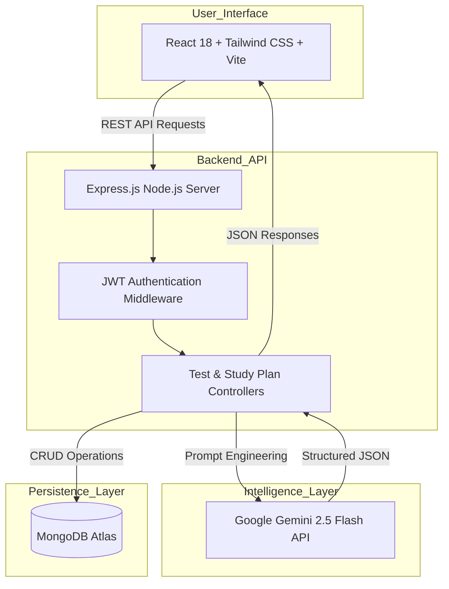

# 🎓 EduBridge AI — Personalized Learning & Feedback Agent

> **Next-Generation AI-Powered Exam Preparation & Dynamic Wellness Platform**  
> *Powered by **Google Gemini 2.5 Flash** & the MERN Stack*

---

## 🌟 Executive Summary

**EduBridge AI** is an intelligent, hyper-personalized learning platform designed to solve student planning paralysis, generic testing, and study burnout. By combining full-stack MERN architecture with cutting-edge **Google Gemini 2.5 Flash** artificial intelligence, EduBridge AI turns raw mock test performance into actionable academic roadmaps and healthy lifestyle routines.

---

## 🚀 What's New: Automated Mock Test Study Roadmap & Healthy Life Balance

- **Automatic Triggering from Mock Tests**: The moment a student completes any AI mock test, EduBridge AI automatically evaluates the test accuracy, score, time per question, and sub-topic mistakes to generate a custom **Study Roadmap**.
- **Healthy Life Balance Routine**: Every generated roadmap incorporates mandatory wellness guidelines — including 7–8 hours of memory-consolidating sleep, 10-minute screen breaks every 45 minutes (Pomodoro), daily exercise, hydration schedules, eye-care routines (20-20-20 rule), and mindfulness exercises.
- **Sub-3-Second AI Generation**: Powered by **Gemini 2.5 Flash** for rapid response times (< 3 seconds) without compromise on reasoning quality.

---

## 📑 Included Architecture & Product Documentation

This repository contains official product architecture and requirement blueprints:
- 📄 **[Architecture Design PDF](./docs/edubridge%20ai%20architecture%20design.pdf)** — System infrastructure, data flows, and component interactions.
- 📝 **[Product Requirements Document (PRD)](./docs/Product-Requirements-Document-PRD-EduBridge-AI.md)** — Comprehensive specification, persona mapping, and feature scope.

---

## ✨ Core Key Features

### 1. 🎯 Dynamic AI Mock Test Generator
- **Gemini 2.5 Flash Engine**: Generates unique, non-repetitive MCQs tailored by Subject, Chapter, Topic, Class Grade, and Difficulty.
- **Anti-Duplication Algorithm**: Server-side string distance and hash checks prevent duplicate questions.
- **Competitive Scoring & Negative Marking**: Supports exam-specific rules (+4 / -1 for JEE Main, NEET, GATE, UPSC, etc.).

### 2. 📅 Automated AI Study Roadmap & Healthy Life Balance
- **Triggered on Test Submission**: Automatically updates when you submit a mock test based on your latest score and accuracy.
- **Daily Checklist**: Interactive daily task list backed by MongoDB persistence.
- **Topic Priority Matrix**: Categorizes topics into High/Medium/Low priority based on learning gap scores.
- **Wellness & Routine Manager**: Includes sleep schedules, screen break intervals, exercise, and meditation guidance.
- **PDF Export**: Downloadable color-coded PDF study plan powered by `html2canvas` & `jspdf`.

### 3. 📄 AI Marksheet & Grade Card Analyzer
- **Multi-Format OCR**: Extracts subject marks, CGPA/SGPA, and division from uploaded PDFs and images.
- **Academic Risk Assessment**: Categorizes student standing (Outstanding, Proficient, Developing, Critical).
- **Teacher & Parent Reports**: Generates pedagogical advice for educators and home support tips for parents.

### 4. 📊 Analytics Dashboard & Diagnostic Radar
- **Overall Accuracy & Streaks**: Visualizes continuous test streaks, best/weakest subjects, and learning gap scores.
- **Topic & Chapter Heatmaps**: Identifies conceptual breakdowns before major exams.

### 5. 🤖 24/7 Interactive AI Test Mentor
- Contextual chat assistant for step-by-step doubt resolution post mock test.

---

## 🏗️ System Architecture



---

## 🛠️ Tech Stack

| Domain | Technology | Description |
| :--- | :--- | :--- |
| **Frontend** | React 18, Vite, Tailwind CSS, Lucide Icons, jsPDF | Responsive, glassmorphism UI with sub-second rendering |
| **Backend** | Node.js, Express.js, Mongoose | Modular RESTful API architecture |
| **AI Model** | **Google Gemini 2.5 Flash** (`@google/generative-ai`) | High-speed LLM for test generation & study roadmap synthesis |
| **Database** | MongoDB Atlas | Schemas for Users, MockTests, Attempts, Feedbacks, and StudyPlans |
| **Authentication** | JWT (JSON Web Token), Bcrypt.js | Secure stateless authentication |

---

## ⚙️ Environment Setup & Installation

### Prerequisites
- Node.js (v18+ recommended)
- MongoDB Atlas database connection string
- Google Gemini API Key ([Get Key from Google AI Studio](https://aistudio.google.com/))

### 1. Clone Repository
```bash
git clone https://github.com/SiddharthK1257/EduBridge-AI---Personalized-Learning-Feedback-Agent.git
cd EduBridge-AI---Personalized-Learning-Feedback-Agent
```

### 2. Configure Backend `.env`
Navigate to `./backend` and ensure `.env` is configured:
```env
PORT=5000
MONGO_URI=mongodb+srv://<username>:<password>@cluster0.mongodb.net/edubridge
JWT_SECRET=your_super_secret_jwt_key
GEMINI_API_KEY=your_gemini_2.5_flash_api_key
```

### 3. Install Dependencies & Run Locally

#### Backend Server:
```bash
cd backend
npm install
npm run dev
```

#### Frontend Client:
```bash
cd frontend
npm install
npm run dev
```

The application will be accessible at `http://localhost:5173`.

---

## 📄 License & Attribution
Designed & Created for **EduBridge AI**. Open-source contribution under the MIT License.
